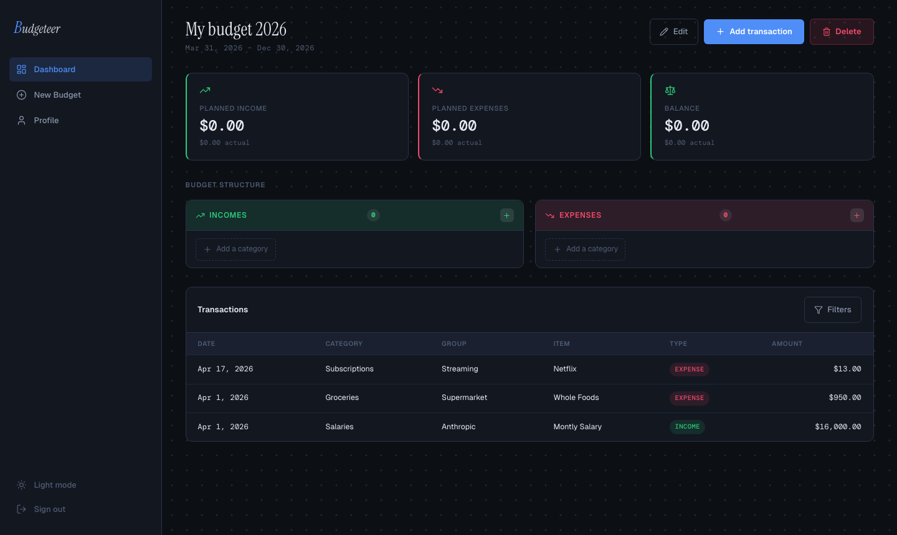
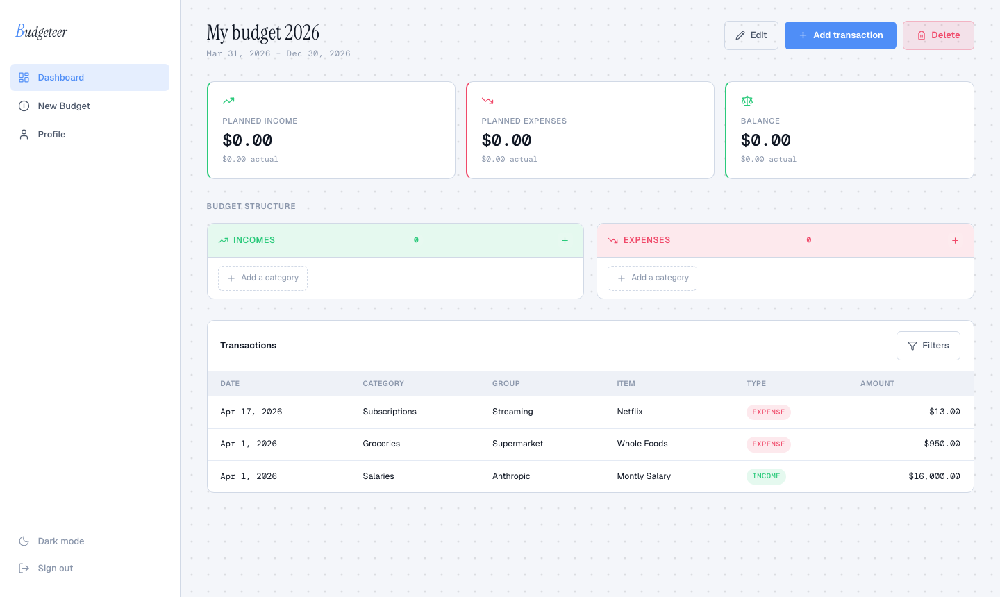
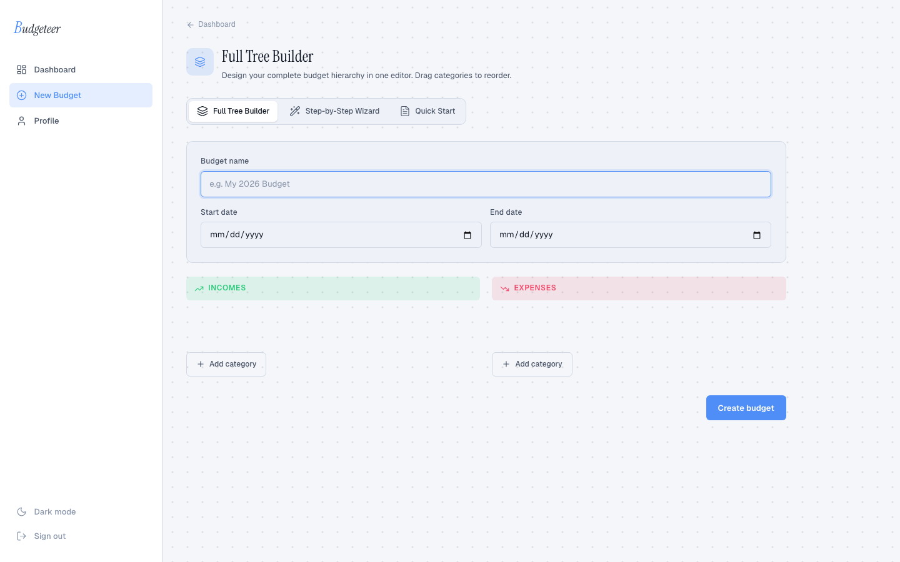
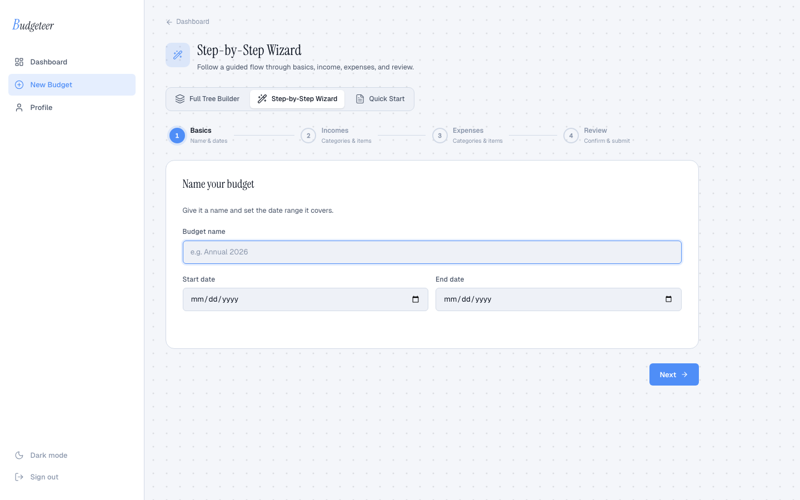
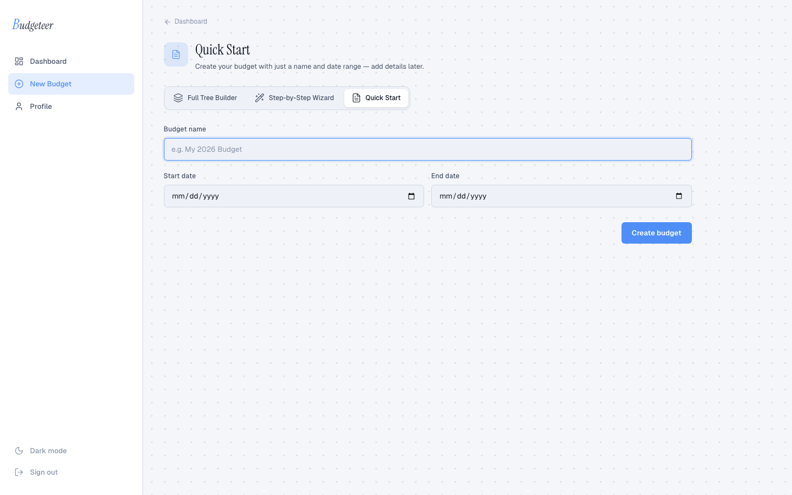

# Budgeteer — Frontend

A personal budgeting web app built with React 19 and TanStack Router. Plan income and expenses in a hierarchical tree (categories → groups → items), track actual spend against calendar-based buckets, and record immutable transactions — all in a dark/light themeable, typography-first UI.


---

## Table of Contents

- [Screenshots](#screenshots)
- [Why Budgeteer?](#why-budgeteer)
- [Tech Stack](#tech-stack)
- [Installation](#installation)
- [Quick Start](#quick-start)
- [Project Structure](#project-structure)
- [Pages & Features](#pages--features)
- [Design System](#design-system)
- [What I Learned](#what-i-learned)
- [Roadmap](#roadmap)
- [License](#license)
- [Author](#author)

---

## Screenshots

### Login page
| Dark mode | Light mode |
|---|---|
|  |  |

### Dashboard
| Dark mode | Light mode |
|---|---|
|  |  |

### Budget creation — Full Tree Builder



### Budget creation — Step-by-Step Wizard



### Budget creation — Quick Start



---

## Why Budgeteer?

Most budgeting UIs are either spreadsheet-like grids or opinionated SaaS products. Budgeteer takes a different approach: a collapsible tree that mirrors how most people think about money — by category, then sub-group, then individual line items. Each item automatically generates calendar buckets (monthly, quarterly, etc.) so planned vs. actual tracking is always period-aware, not just a running total.

---

## Tech Stack

| Concern | Technology |
|---------|-----------|
| UI framework | React 19 |
| Language | TypeScript 5 (strict + `erasableSyntaxOnly`) |
| Build tool | Vite 8 |
| Routing | TanStack Router v1 (file-based, type-safe) |
| Server state | TanStack Query v5 |
| Forms | React Hook Form v7 + Zod v4 |
| Styling | Tailwind CSS v4 + CSS Modules |
| Drag & drop | dnd-kit |
| Icons | Lucide React |
| HTTP | Fetch API (thin wrapper with JWT injection) |

---

## Installation

### Prerequisites

- Node.js ≥ 18
- npm
- The [Budgeteer backend](../backend/README.md) running on `http://localhost:3000`

### Steps

```bash
# 1. From the repo root, enter the frontend directory
cd budgeteerApp/frontend

# 2. Install dependencies
npm install

# 3. Start the dev server
npm run dev
```

The app will be available at `http://localhost:5173`.

The Vite dev server proxies all `/api` requests to `http://localhost:3000`, so no environment variables are needed for local development.

---

## Quick Start

1. Start the backend: `cd ../backend && npm run dev`
2. Start the frontend: `npm run dev`
3. Open `http://localhost:5173`
4. Register an account, create a budget, add income/expense categories, and record transactions.

### Build for production

```bash
npm run build      # tsc type-check + Vite bundle → dist/
npm run preview    # serve dist/ locally
```

---

## Project Structure

```
src/
├── components/
│   ├── auth/              # Login / register layout wrapper
│   ├── budget/
│   │   ├── creation/      # Three budget creation modes (wizard, tree builder, quick start)
│   │   ├── BudgetDashboard.tsx   # Summary cards + tree + transaction panel
│   │   ├── BudgetTree.tsx        # Collapsible category → group → item tree
│   │   ├── CategoryModals.tsx    # Add / edit category dialogs
│   │   ├── GroupModals.tsx       # Add / edit group dialogs
│   │   └── ItemModals.tsx        # Add / edit item dialogs
│   ├── txn/
│   │   ├── AddTransactionDrawer.tsx  # Slide-in drawer to record a transaction
│   │   └── TransactionPanel.tsx      # Filterable, paginated transaction list
│   ├── layout/            # AppShell, Sidebar, AuthProvider, PageSpinner
│   └── ui/                # ConfirmDialog, FormDialog (shared primitives)
├── hooks/
│   ├── useBudget.ts           # GET /budget, DELETE /budget/:id
│   ├── useBudgetCRUD.ts       # 9 mutation hooks (category / group / item CRUD)
│   ├── useCreateBudget.ts     # POST /budget
│   ├── useTransactions.ts     # GET /transactions + filtered query
│   └── useProfile.ts          # GET /auth/me, POST /auth/unsubscribe
├── lib/
│   ├── api.ts             # Fetch wrapper with Bearer token injection
│   ├── auth.ts            # localStorage token helpers
│   ├── schemas.ts         # Shared Zod schemas + TypeScript interfaces
│   └── utils.ts           # formatCurrency, formatDate, capitalize
└── routes/
    ├── index.tsx           # TanStack Router tree + auth guards
    ├── LoginPage.tsx
    ├── RegisterPage.tsx
    ├── DashboardPage.tsx
    ├── BudgetNewPage.tsx
    └── ProfilePage.tsx
```

---

## Pages & Features

### Dashboard (`/dashboard`)
- Summary cards: planned income, planned expenses, balance — all computed from bucket totals (not single-occurrence amounts)
- Budget structure tree with inline add/edit/delete for categories, groups, and items
- Transaction panel with filters (date range, type, category, item) and client-side pagination

### Budget Creation (`/budget/new`)
Three modes selectable via tab:

| Mode | Description |
|------|-------------|
| **Full Tree Builder** | Build the complete category → group → item hierarchy upfront with drag-to-reorder categories (dnd-kit) |
| **Step-by-Step Wizard** | Four-step guided flow: basics → incomes → expenses → review with occurrence-aware totals |
| **Quick Start** | Name and dates only — add structure later from the dashboard |

### Profile (`/profile`)
- View account details
- Delete account (with confirmation dialog)

### Auth (`/login`, `/register`)
- JWT-based; token stored in `localStorage`
- Route-level `beforeLoad` guards redirect unauthenticated users to `/login`

---

## Design System

The UI uses a custom dark/light slate palette with emerald income accents and rose expense accents, built with CSS custom properties. All color tokens are defined in `src/styles/globals.css` and switch automatically when the `data-theme` attribute on `<html>` changes.

**Theming**
- Toggle button in the sidebar switches between dark and light mode
- Preference is persisted to `localStorage` and applied via an inline script in `index.html` before React mounts (no flash of incorrect theme)
- Default follows the OS `prefers-color-scheme` setting on first visit

**Typography**
- `Instrument Serif` — display headings
- `DM Mono` — numeric values and monospaced data
- `Geist` — body and UI text

**CSS tokens (defined in `src/styles/globals.css`)**

```css
--bg-base        /* Page background */
--bg-surface     /* Card / panel surfaces */
--bg-elevated    /* Hover states, nested panels */
--bg-overlay     /* Dropdowns, modals */
--income-base    /* Emerald green accent */
--expense-base   /* Rose accent */
--text-primary / --text-secondary / --text-muted
--border / --border-subtle
--radius / --radius-sm
```

**Background**
- App shell: subtle repeating dot-grid pattern (opacity adapts per theme)
- Login page: supports a full-bleed photo background — place any finance-related PNG at `public/login-bg.png`

---

## What I Learned

### TanStack Router v1 — type-safe file-based routing

TanStack Router v1 generates a fully type-safe route tree. `validateSearch` coerces and validates URL search params through a Zod schema so `useSearch()` always returns a typed object. `beforeLoad` throws a redirect for auth guards, keeping guard logic co-located with the route definition rather than scattered across components.

Key docs: [TanStack Router — File-based routing](https://tanstack.com/router/latest/docs/framework/react/guide/file-based-routing)

### TanStack Query v5 — optimistic cache updates without re-fetching

Instead of invalidating and re-fetching the entire budget after a CRUD mutation, each mutation hook calls `qc.setQueryData(BUDGET_KEY, updater)` with an in-memory updater function. This keeps the UI snappy and avoids a round-trip for every add/rename/delete in the tree.

Key docs: [TanStack Query — Optimistic Updates](https://tanstack.com/query/latest/docs/framework/react/guides/optimistic-updates)

### React Hook Form — uncontrolled inputs with Zod validation

`register()` wires inputs directly to the DOM without React state, giving near-zero re-renders during typing. `zodResolver` runs the full Zod schema on submit (and on blur/change where configured). The key constraint: never mix `register()` with a controlled `value=` prop on the same input — RHF registers an `onChange` handler that conflicts with React's controlled input model and causes stale-value bugs.

Key docs: [React Hook Form — register](https://react-hook-form.com/docs/useform/register)

### Tailwind CSS v4 — Vite plugin, no config file

Tailwind v4 ships as a Vite plugin (`@tailwindcss/vite`) and no longer requires `tailwind.config.js`. The entire configuration lives in CSS via `@theme` and `@layer`. Google Fonts `@import` must appear before `@import "tailwindcss"` in the entry CSS file or Vite emits a warning about import order.

Key docs: [Tailwind CSS v4 — Installation with Vite](https://tailwindcss.com/docs/installation/vite)

### dnd-kit — drag-to-reorder with stable keys

`DndContext` + `SortableContext` (with `verticalListSortingStrategy`) handles the drag-to-reorder categories feature. Each draggable item must have a stable, non-index key — the draft model assigns a `uid` (generated once on creation) for this purpose. Using array indices as dnd-kit IDs causes incorrect reorder behaviour when items are added or removed between drags.

Key docs: [dnd-kit — Sortable](https://docs.dndkit.com/presets/sortable)

### `refetchQueries` vs. `invalidateQueries` after mutations

`invalidateQueries` marks a query as stale and schedules a background refetch for active observers — but "active" means the refetch may still be deferred if React Query decides the data is fresh enough or the component is not focused. `refetchQueries` triggers an immediate, unconditional refetch regardless of stale state.

For mutations whose response depends on a backend side effect (like `allocateToItemBucket` incrementing a bucket's `currentAmount`), using `refetchQueries` on the budget key ensures the UI always sees fresh data, even if the server-side write and the cache invalidation race.

```ts
onSuccess: () => {
  qc.invalidateQueries({ queryKey: ['transactions'] }) // list can background-refresh
  qc.refetchQueries({ queryKey: ['budget'] })          // force immediate refresh
},
```

Key docs: [TanStack Query — refetchQueries](https://tanstack.com/query/latest/docs/reference/QueryClient#queryclientrefetchqueries)

### Bucket totals vs. per-occurrence amounts

The backend generates one `ItemBucket` per calendar period (e.g. 12 buckets for a monthly item in a 1-year budget). Each bucket has its own `plannedAmount`. The UI must sum `bucket.plannedAmount` across all buckets to get the true period total — **not** `item.plannedAmount`, which is only the single-occurrence amount.

In the wizard review step (before the budget exists and buckets have not been generated), occurrence count is computed client-side by mirroring the backend's calendar-period logic for each `frequency` value.

### TypeScript `erasableSyntaxOnly`

TypeScript 5.8+ supports `"erasableSyntaxOnly": true` in `tsconfig.json`. This disallows syntax that can't be stripped cleanly by a type-eraser (like `const enum`, parameter properties on classes). Any class that uses constructor parameter shorthand (`constructor(public foo: string)`) must be rewritten to declare fields explicitly.

---

## Roadmap

- [x] Auth (register, login, logout, delete account)
- [x] Budget creation — three modes (tree builder, wizard, quick start)
- [x] Budget tree CRUD (categories, groups, items) with inline modals
- [x] Transaction drawer with auto-populated budget item selector
- [x] Transaction panel with filters and pagination
- [x] Calendar-aware planned vs. actual totals (bucket aggregation)
- [x] Profile page
- [x] Dark / light theme toggle (system default, persists to localStorage)
- [ ] Test suite (React Testing Library + Vitest)
- [ ] Insights page — spending analytics, planned vs. actual comparisons, best-practice recommendations
- [ ] Projections page — forward projections until budget end date based on historical transactions
- [ ] Reports page — export budget and transaction data to XLSX and PDF
- [ ] Multi-budget support (pending backend change)
- [ ] Budget export to CSV / PDF

---

## Contributing

1. Fork the repo and create a feature branch: `git checkout -b feat/your-feature`
2. Run the dev server: `npm run dev`
3. Type-check before committing: `npx tsc --noEmit`
4. Open a pull request against `main`.

Commit style: `type(scope): message` — e.g. `feat(tree): add drag-to-reorder for categories`.

---

## License

Distributed under the MIT License.

---

## Author

**Gustavo Sanchez** — [gustavosanchez.dev](https://www.gustavosanchez.dev)

[](https://github.com/gusanchefullstack)
[](https://www.linkedin.com/in/gustavosanchezgalarza/)
